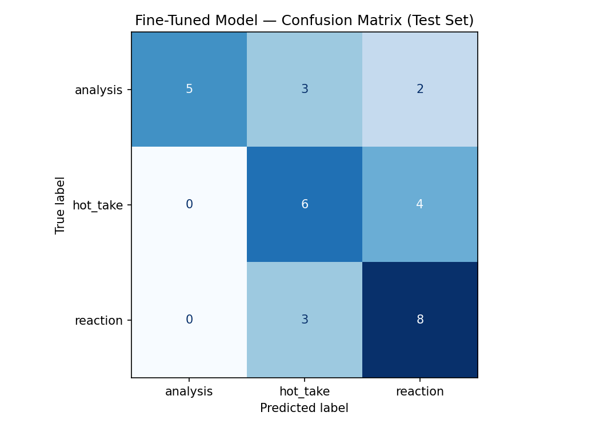

# TakeMeter

A fine-tuned text classifier for r/soccer discourse quality, distinguishing **analysis**, **hot_take**, and **reaction** posts. Fine-tunes `distilbert-base-uncased` on 201 manually labeled Reddit comments and compares it to a zero-shot Groq baseline.

---

## Community

**r/soccer** is one of Reddit's largest sports communities, with millions of members posting around matches, transfers, tactics, and player debates. Discourse quality varies enormously within a single thread: a stat-backed tactical breakdown, a confident claim with no supporting evidence, and a pure emotional outburst after a goal can all appear in the same reply chain. The analysis/hot_take/reaction distinction is one that community members explicitly make ("do you have stats for that?", "this is just a hot take"), which means the labels reflect real community norms rather than an imposed external taxonomy.

---

## Label Taxonomy

| Label | Definition | Signals |
|---|---|---|
| `analysis` | A structured argument backed by statistics, historical comparison, or tactical observation. Evidence is specific and verifiable. | Numbers with context, cross-player/season comparisons, causal tactical reasoning |
| `hot_take` | A bold, confident opinion stated without supporting evidence. The claim might be true, but the post asserts rather than argues. | Strong declarative claims, superlatives, no load-bearing evidence |
| `reaction` | An immediate emotional response to a specific event. Little to no argument — the post is expressing a feeling in the moment. | Event-anchored language, exclamations, short match-specific posts |

### Examples per label

**analysis:**
- "Over the last 3 seasons, Salah has averaged 0.71 non-penalty goals per 90 — higher than any other PL winger in that window. His off-ball movement has changed too: he now makes 40% more runs in behind compared to 2020/21."
- "Comparing City's xGA under Guardiola with and without Rodri in the lineup (47 matches), the gap is 0.31 xGA/90. That reflects how Rodri's positioning compresses opposition counter-attack lanes."

**hot_take:**
- "Bellingham is overrated and Madrid made a mistake. He's not a top-5 midfielder in the world."
- "English clubs will never win the Champions League consistently. The Premier League is just entertainment football."

**reaction:**
- "THAT GOAL. I'm shaking. Best night of my life as a football fan."
- "I can't watch anymore. Three nil down at half time. Season is done."

### Decision rules for hard edge cases

**analysis vs. hot_take:** Remove the opinion framing and ask — does the remaining evidence build a coherent argument, or does it just make the assertion sound credible? A single stat without comparison or context is decorative → `hot_take`. A stat with comparative framing, causal explanation, or a verifiable chain of reasoning → `analysis`.

**hot_take vs. reaction:** If the claim extends beyond the specific event — a general verdict on a player or team that would still hold after the match is forgotten — label `hot_take`. If the post stays anchored to the moment and expresses a feeling without forming a broader verdict, label `reaction`.

**analysis vs. reaction:** The trigger does not determine the label — the structure does. A post explaining a mechanism with evidence is `analysis` even if prompted by a live match. A post expressing emotion about what just happened is `reaction` even if it mentions a stat.

---

## Dataset

**Source:** r/soccer on Reddit — public posts and top-level comments from match threads, transfer discussion threads, and tactical discussion posts. All examples are public and require no authentication.

**Collection:** Manual copy-paste into a spreadsheet, exported to `data/soccer_posts.csv`. High-confidence examples were preferred; posts estimated at ≤128 tokens were prioritized to fit within DistilBERT's token limit.

**Labeling:** Each example was read and labeled against the definitions above. For borderline cases, the decision rules above were applied before assigning a label.

**Label distribution:**

| Label | Count |
|---|---|
| `analysis` | 67 |
| `hot_take` | 67 |
| `reaction` | 67 |
| **Total** | **201** |

Split: 70% train (140) / 15% validation (30) / 15% test (31), stratified by label.

### Dataset limitations

**Reply comments:** Some examples are reply comments containing anaphoric references ("he", "that", "exactly") or sarcasm that only make sense with the parent comment as context. The model classifies each comment in isolation — three wrong predictions (#2, #3, #10) involve reply comments where the meaning depends on what was said above them in the thread.

**Topic clustering:** The dataset draws from a small number of match threads (notably France/Norway and Korea/Klinsmann discussions). The random split does not guarantee topic diversity between train and test — examples from the same match likely appear in both. The model may have learned topic-specific shortcuts alongside discourse-type signals, making the 0.613 accuracy somewhat optimistic for entirely unseen topics or communities.

### Three difficult-to-label examples

**1. Single stat + strong opinion (analysis vs. hot_take)**
> "Mbappe is clearly the best forward in the world right now. He had 44 goals and assists last season."

Labeled **hot_take**. The stat is decorative — it makes the assertion sound credible but doesn't build a comparative argument. Removing the framing, the stat alone can't convince a skeptic; it was selected for effect rather than as part of a chain of reasoning.

**2. Event-triggered verdict (reaction vs. hot_take)**
> "After that performance, I'm convinced Maguire is genuinely one of the worst defenders in the Premier League."

Labeled **hot_take**. The word "convinced" signals a general verdict forming. The claim extends beyond the specific match — it would still hold after the game is forgotten. A reaction post stays anchored to the moment; this one uses the moment as evidence for a general position.

**3. Emotional framing + tactical data (reaction vs. analysis)**
> "Incredible today — City pressed 34 times in the final third, recovered 12 balls. That's exactly why they dominated."

Labeled **analysis**. The emotional trigger does not determine the label — the structure does. This post explains a causal mechanism with verifiable numbers, regardless of what prompted it. "That's exactly why" is an analytical claim backed by load-bearing evidence.

---

## Fine-Tuning Pipeline

**Base model:** `distilbert-base-uncased` — 66M parameters, pretrained on English text. The classification head (3 outputs) was randomly initialized; all weights were updated during fine-tuning.

**Training environment:** Google Colab T4 GPU (~5 minutes to train).

| Hyperparameter | Value |
|---|---|
| Epochs | 10 |
| Learning rate | 2e-5 |
| Batch size | 16 |
| Warmup steps | 0 |
| Weight decay | 0.01 |
| Max token length | 128 |
| Best model selection | Max validation accuracy (`load_best_model_at_end=True`) |

**Key hyperparameter decisions:**

*Warmup steps = 0:* The default value of 50 exceeded total training steps for the first few epochs (~9 steps/epoch × 3 epochs = 27 total). When warmup steps > total steps, the learning rate never reaches its target — it stays near zero for the entire run, and loss locks at ln(3) ≈ 1.099 (the uniform-distribution baseline) regardless of epochs. Setting warmup to 0 resolved this immediately.

*Epochs = 10:* With 140 training examples, the model peaks at epoch 1–2 on the validation set and overfits after that. Running 10 epochs with `load_best_model_at_end=True` ensures the best checkpoint is captured regardless of when it appears. The extra epochs confirm the overfitting curve but do not affect the saved model.

---

## Baseline

**Model:** `llama-3.3-70b-versatile` via Groq, zero-shot (`temperature=0`, `max_tokens=20`)

**Prompt:**

```
You are classifying posts from r/soccer by discourse type. Classify the post
into exactly one of these three labels:

- analysis: The post makes a structured argument backed by statistics,
  historical comparison, or tactical observation. Evidence is specific
  and verifiable.
- hot_take: A bold, confident opinion stated without supporting evidence.
  The claim might be true, but the post asserts rather than argues.
- reaction: An immediate emotional response to a specific event. Little
  to no argument — the post is expressing a feeling in the moment.

Return only the label and your reasoning. Do not explain the taxonomy.
```

**Collection:** Run on the locked test set (31 examples) with a 0.1s delay between requests to respect Groq free-tier rate limits. All 31 responses were parseable — no fallback cases.

---

## Evaluation Report

### Results

| Model | Overall accuracy |
|---|---|
| Zero-shot baseline (Groq llama-3.3-70b-versatile) | 0.419 |
| Fine-tuned DistilBERT | **0.613** |
| Improvement | **+0.194** |

### Per-class metrics

**Baseline (zero-shot):**

| Label | Precision | Recall | F1 | Support |
|---|---|---|---|---|
| `analysis` | 1.00 | 0.30 | 0.46 | 10 |
| `hot_take` | 0.33 | 0.40 | 0.36 | 10 |
| `reaction` | 0.38 | 0.55 | 0.44 | 11 |
| macro avg | 0.57 | 0.42 | 0.42 | 31 |

**Fine-tuned DistilBERT:**

| Label | Precision | Recall | F1 | Support |
|---|---|---|---|---|
| `analysis` | 1.00 | 0.50 | 0.67 | 10 |
| `hot_take` | 0.50 | 0.60 | 0.55 | 10 |
| `reaction` | 0.57 | 0.73 | 0.64 | 11 |
| macro avg | 0.69 | 0.61 | 0.62 | 31 |

### Confusion matrix (fine-tuned model, test set)

| | Pred: analysis | Pred: hot_take | Pred: reaction |
|---|---|---|---|
| **True: analysis** | 5 | 3 | 2 |
| **True: hot_take** | 0 | 6 | 4 |
| **True: reaction** | 0 | 3 | 8 |



The model never predicts `analysis` incorrectly (precision 1.00, zero false positives). The dominant failure is the **hot_take ↔ reaction boundary**: 7 of 12 wrong predictions involve these two labels (4 hot_take→reaction, 3 reaction→hot_take). The analysis/hot_take boundary, which was predicted hardest in the planning phase, accounts for only 3 errors.

### Wrong predictions — analysis

**Wrong prediction 1: confident verdict misread as reaction**
> "Michael Oliver is best in class (even though Im sure a lot of the Prem people would disagree)"
> True: `hot_take` | Predicted: `reaction` (confidence: 0.62)

This is a textbook hot_take — a confident claim about a referee with no evidence, and the author explicitly acknowledges its controversy. The model predicted `reaction`, likely because the post is short and informal in register. The model learned that brevity and casual tone signal `reaction`, independent of whether the post makes a general verdict or expresses a moment. This is a surface-feature error: the model keyed on style, not structure.

**Wrong prediction 2: framing overrides numerical content**
> "First that comes to mind for me is Richard Rios: sold for 1M at 22yo after the previous world cup and now sold for 27M"
> True: `analysis` | Predicted: `reaction` (confidence: 0.66)

This post contains specific numerical evidence (1M → 27M, age 22) and a factual cross-time comparison — both strong analysis signals. The model predicted `reaction` with high confidence (0.66), likely because the conversational opener "First that comes to mind for me is" strongly resembles the first-person, in-the-moment language of reaction posts. The model weighted the framing over the content. The fix would require more training examples of analysis posts with conversational openers that nonetheless contain load-bearing evidence.

**Wrong prediction 3: sarcasm predicted as hot_take**
> "and thank you for informing me that Germany did not press during the game versus Paraguay"
> True: `reaction` | Predicted: `hot_take` (confidence: 0.55)

This is sarcasm — the author already knew Germany didn't press and is reacting sarcastically to an unnecessary correction. The model predicted `hot_take`, reading it as a confident claim because the surface form ("thank you for informing me...") resembles a declarative assertion. This is a fundamental limitation: without sarcasm detection, a sarcastic reaction is indistinguishable from a confident opinion at the token level. This error likely cannot be fixed without substantially more sarcasm examples in the training set.

### What the error pattern reveals

The 7 hot_take/reaction errors were not predicted — planning.md identified the analysis/hot_take boundary as hardest. The reason this boundary turned out harder is structural to r/soccer: hot_takes in this community are often short, match-triggered, and informal, making them look exactly like reactions. The model learned a useful but incomplete shortcut: `analysis` requires numbers, `reaction` is short or first-person, `hot_take` is assertive. This fails when a post has the framing of one class and the structure of another.

### Sample classifications

| # | Text (truncated) | True | Predicted | Confidence |
|---|---|---|---|---|
| 1 | "You've coded pressing to mean tackles+interceptions? That's not how this works?..." | `analysis` | `analysis` | 0.72 |
| 2 | "CONCACAF is truly mid!" | `reaction` | `reaction` | 0.82 |
| 3 | "What does that have to do with anything though? Norway still gave the match away..." | `hot_take` | `hot_take` | 0.86 |
| 4 | "Has to be the worst match of the tournament, not because of what happened but..." | `hot_take` | `hot_take` | 0.80 |
| 5 | "Mbappe played, what's his excuse" | `reaction` | `reaction` | 0.86 |

**Why prediction #1 is reasonable:** The post directly challenges a methodological claim about how pressing is measured and explains the correct interpretation. Despite being phrased as a question, the structure is analytical: it identifies a specific error, explains why it's wrong, and implies the right alternative. The model correctly identifies this as `analysis` at 0.72 confidence — notable because the post has no explicit statistics and uses a questioning register that could read as reaction.

---

## Reflection — What the model learned vs. what I intended

**What the model learned:** Surface features correlated with each label — numbers and comparisons signal `analysis`; brevity and informal register signal `reaction`; strong declarative assertions signal `hot_take`. These are valid proxies in most cases, which explains the 0.613 accuracy.

**Where it diverges from intent:** The label definitions are structural — they describe the logical form of a post (does the evidence load-bear? does the claim form a general verdict?). The model learned stylistic proxies for those structural features. A post with a conversational opener but numerical content gets mislabeled as `reaction`. A short assertive post gets mislabeled as `reaction` if it lacks strong-opinion vocabulary. A sarcastic reaction gets mislabeled as `hot_take` because sarcasm and confidence look the same at the token level.

**Topic shortcuts and reply context:** Two dataset construction issues likely contributed additional noise. First, the random split does not guarantee topic diversity — examples from the same match thread appear in both train and test, so the model may have learned match-specific vocabulary alongside discourse signals (e.g., player names or event phrases correlated with a label). Second, several examples are reply comments whose meaning depends on a parent comment the model never sees. Both issues make the 0.613 accuracy somewhat optimistic: accuracy on entirely new topics or on a more carefully de-duplicated split would likely be lower.

**Hypothesis scorecard:**

| Hypothesis | Result |
|---|---|
| Fine-tuning fixes analysis recall first | Partially confirmed — recall went 0.30 → 0.50 |
| Analysis/hot_take confusion narrows | Confirmed — analysis precision is now 1.00, zero false positives |
| Reaction is the easiest class | Confirmed — reaction F1 0.64 is among the highest |
| Overall accuracy exceeds 65% | Not met — 0.613 fell short of the minimum threshold |

The accuracy gap reflects the dataset size constraint. With 140 training examples, the model converges to stylistic shortcuts rather than learning structural distinctions. The shortcut is informative enough to beat random chance and the zero-shot baseline by a wide margin, but not informative enough to cross the 0.65 threshold. Getting there would require roughly 300–400 examples with deliberate over-sampling of hard boundary cases: short hot_takes that look like reactions, analysis posts with conversational openers, and sarcastic reactions.

---

## Spec Reflection

**One way the spec helped:** The emphasis on documenting hard edge cases in planning.md before annotating forced explicit decision rules for the analysis/hot_take and hot_take/reaction boundaries before a single example was labeled. Those rules became the annotation standard — without them, similar borderline posts would likely have been labeled inconsistently depending on which direction they were read. The model's 1.00 analysis precision suggests the analysis boundary was learned cleanly, which traces back to having a clear, consistent rule for it.

**One way implementation diverged from the spec:** The spec suggests 3 epochs as the default training setup. In practice, 3 epochs was insufficient not because of underfitting but because the warmup_steps default (50) exceeded total training steps (~27 for 3 epochs), keeping the learning rate near zero throughout. The real fix was warmup_steps=0, not more epochs. This failure mode — warmup steps exceeding total steps on a small dataset — is not covered in the spec and only surfaces if you recognize that loss stuck at ln(3) ≈ 1.099 means the model is predicting uniformly, not learning.

---

## AI Usage

**1. Label stress-testing (before annotation)**
Directed Claude to generate 10 posts at the analysis/hot_take boundary given the label definitions from planning.md. Claude produced posts with single cherry-picked stats framed as confident claims — exactly the borderline type described in the hard edge cases section. Three of the generated posts were genuinely ambiguous; they were used to sharpen the "decorative evidence" decision rule (does the stat load-bear the claim, or just decorate it?) before annotation began. The rule Claude helped surface is the one that appears in planning.md and above.

**2. Fine-tuning debugging (during training)**
When training loss was stuck at ln(3) ≈ 1.099 and accuracy was constant at 0.333 across all epochs, directed Claude to diagnose. Claude identified that warmup_steps=50 exceeded total training steps for the initial 3-epoch configuration (~27 steps), preventing the learning rate from reaching its target. Claude also identified a checkpoint resumption bug where re-running Section 3 without clearing the output directory loaded previously overfit weights, producing misleading results. Both diagnoses were verified by re-running training with the fixes applied and observing healthy loss curves (epoch 1 val loss ~1.03, epoch 2 training loss ~0.7–0.9).

**3. Failure pattern analysis (after evaluation)**
Pasted all 12 wrong predictions into the conversation and directed Claude to identify common themes. Claude identified the hot_take/reaction boundary as the dominant failure (7 of 12 errors) — unexpected, since planning.md had predicted analysis/hot_take would be hardest. Claude also flagged two distinct subtypes: framing-overrides-content (wrong prediction #2) and sarcasm-reads-as-assertion (wrong prediction #3). All three patterns were verified by re-reading the examples manually. The sarcasm finding was kept; the framing finding was kept with a more specific explanation after re-reading example #6.
